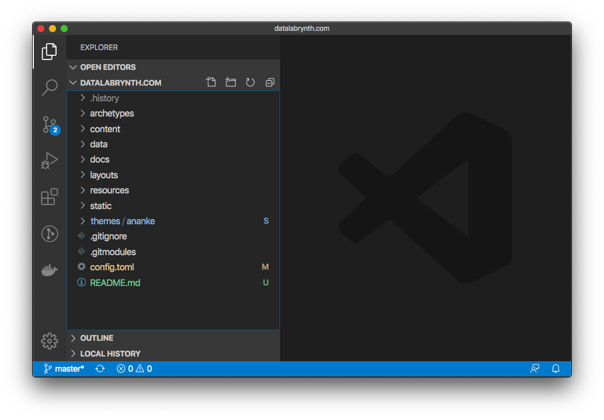

# The DataLabrynth site and code
The website is implemented using the [Hugo](https://gohugo.io/) framework together with the [Ananke](https://github.com/budparr/gohugo-theme-ananke) theme.  
The intent of this page is to provide instructions for how to easily update the site.  
For details about how the website is hosted check [How DataLabrynth.com is hosted](README_GH_PAGES_SETUP.md)

## Install Hugo
You need to have [hugo](https://gohugo.io/getting-started/quick-start/) installed to serve the webpage locally and to build your changes into the webpage.
``` 
$ brew install hugo
```


## Get source code
Get a copy of your website locally. In a clean folder run:
```
$ git clone --recurse-submodules git@github.com:robertbio/datalabrynth.com.git
$ cd datalabrynth.com
```

## Edit the content
Open the cloned folder in your favorite editor ([Visual Studio Code](https://code.visualstudio.com/)) and edit the `.md` files from the `content` folder.  
Each file corresponds to a page.


## Show locally 
Inside the folder of your Hugo site run:
``` 
$ hugo server -D
```
Navigate to your new site at http://localhost:1313/.

## Build production website

``` 
$ hugo -D
``` 
Hugo is configured to build the production website content in the `docs` folder. This is set with GitHub Pages to be the website content.

## Push online
You can either use the Visual Studio Code to commit changes and push to master, or the command line:
```
$ git commit -am "message"
$ git push origin master
```
This will commit the changes and push them to the master branch in GitHub. The website content is everything inside the `docs` directory.