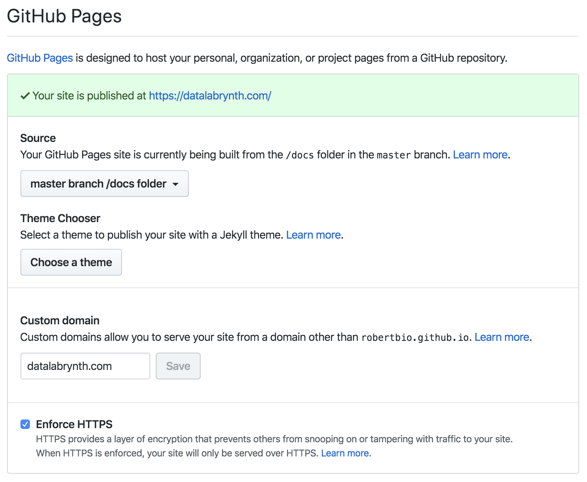
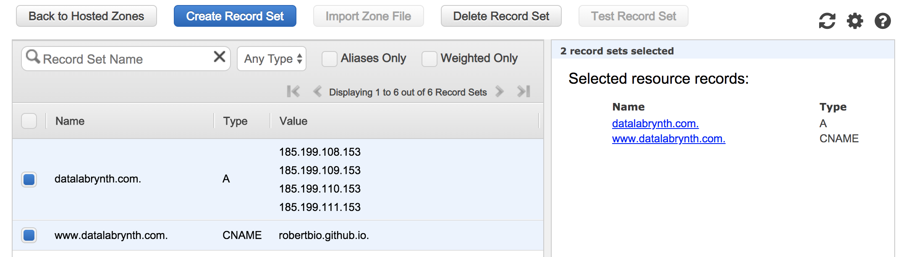

# How [DataLabrynth.com](https://datalabrynth.com) is hosted
This page explains how the [DataLabrynth](https://datalabrynth.com) site is hosted:

* The web site content is static and is created using the [Hugo](https://gohugo.io/) framework with the [Ananke](https://github.com/budparr/gohugo-theme-ananke) theme
* The storage is provided by [GitHub Pages](https://pages.github.com/) for free
* The custom domain is registered at [AWS Route 53](https://aws.amazon.com/route53/)
* SSL is offered by Let's Encrypt through GitHub Pages, for free

## Website and code

The Hugo website source code is in the master branch of the GitHub repository.

The folder `docs` contains the deployed production website. This is set in the Hugo configuration file `config.toml` with the `publishdir` parameter. This is convenient because GitHub Pages has the option to get the website content from `/docs`.

## GitHub Pages Settings/Options

* We set the Source for the site to `master branch /docs folder`.
* The `Custom domain` is set to `dayalabrynth.com`.
  *  This will automatically create a file named `CNAME` in the `/docs` folder.
  *  To make sure that the `CNAME` file is not modified or removed by the builds, it is added to the `.gitignore` file.
* Enforce HTTPS is enabled. This option might be disabled until the DNS records are properly set.

## DNS Records

Two records are set in the AWS Route 53 service ( **A** and a **CNAME** ): 

* The **A** Record `datalabrynth.com` pointing to the GitHub Pages IP servers.  

* The `www` subdomain `www.datalabrynth.com` is pointing to the user's GitHub pages profile URL with a .(dot) at the end. `robertbio.github.io.` This will redirect www urls to the original domain and both urls will go to the same GitHub pages site.

<table>
    <thead>
        <tr>
            <th>Name</th>
            <th>Type</th>
            <th>Value</th>
        </tr>
    </thead>
    <tbody>
        <tr>
            <td rowspan=4>datalabrynth.com</td>
            <td rowspan=4>A</td>
            <td>185.199.108.153</td>
        </tr>
        <tr>
            <td>185.199.109.153</td>
        </tr>
         <tr>
            <td>185.199.110.153</td>
        </tr>
         <tr>
            <td>185.199.111.153</td>
        </tr>
        <tr>
            <td>www.datalabrynth.com</td>
            <td>CNAME</td>
            <td>robertbio.github.io.</td>
        </tr>
    </tbody>
</table>

** note the .(dot) at the end of the CNAME value.

The Records will look like the image below.

For more details, check the [GitHub Pages reference](https://help.github.com/en/github/working-with-github-pages/managing-a-custom-domain-for-your-github-pages-site).
